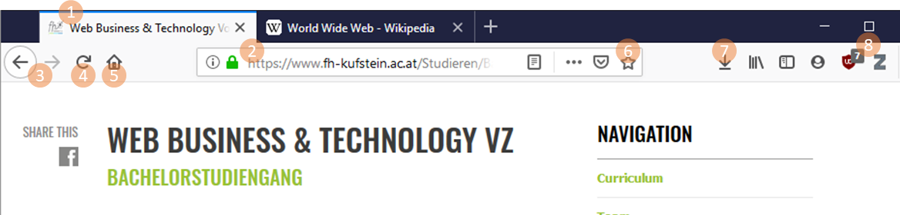

# Web-Grundlagen

# World Wide Web (WWW)

Das WWW ist ein globales und verteiltes Informationssystem bestehend aus Webseiten und anderen Web-Resourcen (zB Bilder, Videos, etc). Web-Resourcen werden auf Web-Servern bereitgestellt und sind öffentlich abrufbar. Jede Web-Resource (Webseite, Bild, Video, etc) ist über einen Uniform Resource Locator (URL) eindeutig identifiziert und abrufbar. Webseiten sind im WWW über sog. Hyperlinks miteinander verknüpft. Hyperlinks werden ebenfalls über einen URL ausgedrückt. Webseiten können über Web-Browser (auch Web-Clients) geladen und bedient werden.

## Technische Grundlagen

Das technische Fundament für das WWW bildet das Internet. Das Internet ist ein globales Netzwerk (Internet = interconnected network), welches Computer und andere Computer Netzwerke (Intranets) miteinander verknüpft. Umgangsprachlich wird das WWW mit Internet oft gleichgesetzt. Aus einer technischen Perspektive ist dies jedoch nicht der Fall.

### Uniform Resource Locator (URL)

Eine URL ist eine global eindeutige "Adresse" einer Web-Resource. Ein Web-Browser kann über eine URL Web-Resourcen herunterladen und letzlich anzeigen. URL folgend einem vorgegebenen syntaktischen Aufbau:

 - Schema (Scheme): Das Schema gibt den Typ der URL an. Bekannte Schemata sind zB `http`, `https`, `ftp` oder `mailto`. Die Schemaangabe wird mit einem `:` abgeschlossen.
 - Zuständigkeit (Authority): Wesentlicher Bestandteil der Authority ist der `Host`, welcher als Domain-Name oder IP-Adresse angegeben werden kann. Optional kann die Authority eine Benutzerinformation enthalten, welche vor der Host-Angabe steht (Abgeschlossen durch ein `@`). Optional kann auch eine Port-Angabe angebracht werden (Eingeleitet durch einen `:`).
 - Pfad (Path): Der Pfad ist eine hierarchische Angabe einer konkreten Ressource innerhalb einer Authority. Alle Pfadbestandteile werden ähnlich zu einem Dateisystem mittels `/` getrennt.
 - Abfrage (Query): Der Abfrage-Teil (Query-String) wird genutzt um optionale Schlüssel-Wert Paare anzugeben. Ein Query-String wird über ein `?` eingeleitet. Schlüssel-Wert Paare werden jeweils über `&` getrennt. Mit `=` wird jeweils der Schlüssel mit dem zugehörigen Wert verknüpft.
 - Fragment: Fragmente können genutzt werden um Teile eine Ressource zu identifizieren, zB als Anker innerhalb einer Webseite. Fragmente werden über ein `#` eingeleitet.

Beispiel einer URL:
```
          userinfo       host      port
          ┌──┴───┐ ┌──────┴──────┐ ┌┴┐
  https://john.doe@www.example.com:123/forum/questions/?tag=networking&order=newest#top
  └─┬─┘   └───────────┬──────────────┘└───────┬───────┘ └───────────┬─────────────┘ └┬┘
  scheme          authority                  path                 query           fragment
```

### Domain Name System (DNS)

Das Internet basiert auf dem TCP/IP Netzwerk-Stack (Internetprotokollfamilie). Im TCP/IP Netzwerk-Stack werden alle Knoten des Netzwerkes über eine IP-Adresse identifiziert. IP-Adresse sind ähnlich wie Telefonnummern für Menschen schwer einprägsam. DNS ist ein Internet-Dienst welcher, ähnlich zu einem Telefonbuch, Klarnamen zu IP-Adressen verwaltet und abrufbar macht.

[//]: # (TODO: richtige IP-Adressen suchen zu den Beispielen)
Auszug aus der Datenbank eines DNS-Servers:
```
wikipedia.org        185.102.12.2
fh-kufstein.ac.at    85.234.32.2
```

Der Web-Browser nimmt in der Adresszeile einen URL entgegen, welcher unter anderem auch einen Domain-Namen enthält. Der Web-Browser würde im ersten Schritt einen DNS-Server anfragen um die IP-Adresse des entsprechenden Domain-Namen zu erhalten.

### HTTP-Protokoll


### Web-Browser

Ein Web-Browser ist eine Software-Applikation welche genutzt wird um auf das WWW zuzugreifen. Die populärsten Web-Browser sind `Chrome`, `Firefox`, `Safari`, `Internet Explorer`, `Edge` und `Opera`.


Web-Browser bieten folgende ähnliche Bedienelemente:
 1. `Tabs` um mehrere Webseiten gleichzeitig zu öffnen. Der `Titel` einer Webseite bzw. das sog. `Favicon` werden ebenfalls im Tab angezeigt.
 2. Eine `Adressleiste` zur Eingabe der URL welche geladen werden soll. Für gesicherte Verbindungen (https) wird dies über ein `Schloss-Symbol` angezeigt. Die Adressleiste fungiert meist auch als `Eingabezeile für Suchmaschinen`.
 3. `Vor- und Zurück-Buttons` um in der Browser-Historie zu navigieren.
 4. Ein Button zum Neuladen einer Webseite (`Refresh` oder `Reload`). Während des Ladens fungiert dieser als `Stop-Button` um das Laden abzubrechen.
 5. Ein `Home-Button` läd eine hinterlegte Home-Seite.
 6. Mittels `Bookmarks/Lesezeichen` können Links auf Webseiten katalogisiert gespeichert werden.
 7. Innerhalb einer `Download-Historie` können vergangene Downloads wiedergefunden werden.
 8. Web-Browser können über `Extensions` erweitert werden.




## W3C und Standardisierung
Das World Wide Web Consortium (W3C) ist die primäre internationale Standardisierungsorganisation des WWW. Das W3C ist für die Standadisierung der technischen Grundlagen des WWW zuständig. Gründer und Vorsitzender des W3C ist Tim Berners-Lee. Tim Berners-Lee ist der "Erfinder" des WWW.

Der W3C Standadisierungsprozess gliedert sich in Dokumente mit unterschiedlichem Reifegrad:
 - Working Draft (WD):
 - Candidate Recommendation (CR):
 - Proposed Recommendation (PR):
 - W3C Recommendation: 

Beispiele von W3C Recommendations: HTML, XML, CSS, PNG, SVG, DOM

## Clientseitige Web-Technologien

Zur Entwicklung von Webseiten bzw. Web-Anwendungen werden standardisierte Web-Technologien genutzt:

 - Hypertext Markup Language (HTML): HTML wird genutzt um Inhalte zu strukturieren
 - Cascading Stylesheets (CSS): CSS wird genutzt um Inhalte zu formatierung bzw. zu gestalten
 - JavaScript: Mit JavaScript wird Verhalten und Dynamik in eine Webseite integriert

# HTML

Die Hypertext Markup Language (HTML) ist eine textbasierte Auszeichnungssprache zur Strukturierung von Webseiten (in diesem Zusammenhant als HTML-Dokumente bezeichnet). HTML basiert auf sog. Tags, welche als Text Bausteine mit den Zeichen `<` bzw. `>` definiert werden. HTML dient dabei nur der Strukturierung der Inhalte und legt keinerlei Formatierung fest.

## HTML-Markup Regeln

Ein HTML-Element hat mehrere Bestandteile:
 - Öffnendes Tag: Ein öffnendes Tag besteht aus den Klammersymbolen `<` und `>` und dem eingeschlossenen Tag-Name (zB `<p>`).
 - Schließendes Tag: Ähnlich zum öffnenden Tag besteht das schließende Tag aus den Klammersymbolen `<` und `>` und dem eingeschlossenen Tag-Namen. Zusätzlich wird durch Angabe des Slash-Symbols (`/`) das schließende Tag markiert (zB `</p>`).
 - Inhalt: Der tatsächliche Inhalt des HTML-Elements kann nur Text sein oder es können auch weitere HTML-Elemente als Kindelemente sein.
 - Attribute: HTML-Elemente können Attribute besitzen, welche zusätzliche Informationen zum HTML-Element liefern, welche nicht Teil des Inhalts sind. Attribute und zugehörige Attributwerte werden im öffnenden Tag angegeben. Das Attribut wird über `=` vom Attributwert getrennt und der Attributwert wird in `"` gesetzt.

Beispiel für ein HTML-Element:
```html
Öffnendes Tag       Schließendes Tag
      ┌┴┐                 ┌┴─┐
      <p>Ein HTML Beispiel</p>
         └───────┬───────┘
               Inhalt
      └──────────┬───────────┘
		     HTML-Element
```

Beispiel für ein HTML-Element mit Attribut:
```html
         Öffnendes Tag
      ┌─────────┴────────┐                 
      <p class="my-class">Ein HTML Beispiel</p>
         └─┬─┘ └───┬────┘
      Attribut   Attributwert      
```

Es gibt Außnahmen, welche nicht den oben beschriebenene allgemeinen Regelungen folgen:
 - Leere HTML-Elemente: Es gibt HTML-Elemente, welche keinen expiziten textlichen Inhalt besitzen. Beispiele dafür sind: 
   - `<br>`: Zeilenumbruch
   - `<hr>`: Horizontale Trennline
   - ``: Bilder
- Boolsche Attribute: Es gibt Attribute, welche keinerlei Attributwert benötigen. Eine Angabe des Attributes würde einen Attributwert `true` implizieren. Ein Beispiel für ein boolsches Attribut ist `disabled`.

## Besondere syntaktische Konstrukte

### HTML Kommentare

In den meisten Programmier- bzw. Auszeichnungssprachen gibt es Kommentare, welche vom Web-Browser zur Generierung der Anzeige ignoriert werden.

Kommentare werden mit der Symbolfolge `<!--` gestartet und mit `-->` beendet.

```html
<!-- Ein Beispiel Kommentar -->
```

### HTML Entities

Es gibt unter anderem die Zeichen `<`, `>`, `"`, `&` welche Teil der HTML Syntax sind. Diese Zeichen müssen als spezielle `HTML-Entity` angegeben werden.

Eine HTML-Entity wird über ein `&` gestaret und mit einem `;` abgeschlossen. Dazwischen befindet sich ein Entitiy Bezeichner.

Beispiele für HTML-Entities:
| Zeichen | HTML-Entity  |
| --- | --- |
| `<` | `&lt;` |
| `>` | `&gt;` |
| `"` | `&quot;` |
| `&` | `&amp;` |

### Whitespace

Als Whitespace werden jegliche Leerräume, Tabulatoren und Zeilenumbrüche bezeichnet. Für die Darstellung von HTML hat Whitespace keine bedeutung. Der Web-Browser ignoriert Whitespace generell und reduziert Whitespace zwischen 2 Wörtern auf genau einen Leerraum.

Die beiden Paragraphen im folgenden Beispiel resultieren in der selben Anzeige:
```html
<p>Beispiel für Whitespace</p>

<p>Beispiel        für
         Whitespace.</p>
```

## Aufbau eines HTML-Dokumentes

HTML-Dokumente haben einen definierten Aufbau:

 - Ein HTML-Dokument startet mit einem `Doctype`, welcher die Version von HTML angibt (hier: HTML 5). Dem Web-Browser wird damit mitgeteilt, welche HTML-Version zu verarbeiten ist.
 - Ein HTML-Dokument hat `html` als Wurzelelement und 2 Kindelemente `head` und `body`
 - Im `head` befinden sich sog. Metadaten zum Dokument (zumindest der Titel, angegeben durch das `title` Element)
 - Im `body` befinden sich alle Inhalte, welche im Web-Browser dargestellt werden

```html
<!DOCTYPE html>
<html>
  <head>
    <title>Meine Seite</title>
  </head>
  <body>
    <!-- HTML Elemente -->
  </body>
</html>
```

## Flow Layout

## Wichtige HTML-Elemente

### Überschriften

Überschriften werden über die Tags `h1-h6` angegeben. Die Zahlen 1-6 spezifizieren dabei die Hierarchieebene. Überschriften sind Block-Elemente.

Beispiel für Überschriften:
```html
<h1>Überschrift Ebene 1</h1>
<h2>Überschrift Ebene 2</h2>
<h3>Überschrift Ebene 3</h3>
<h4>Überschrift Ebene 4</h4>
<h5>Überschrift Ebene 5</h5>
<h6>Überschrift Ebene 6</h6>
```

### Paragraphen

Zusammenhängende Textabschnitte werden als Paragraphen über das `p-Tag` angegeben. Paragraphen sind Block-Elemente.

Beispiel für 2 Paragraphen:
```html
<p>Ein erster Paragraph</p>
<p>Ein zweiter Paragraph</p>
```

### Geordnete oder Ungeordnete Listen

Listen können über die Tags `ul` (ungeordnet) oder `ol` (geordnet) angegeben werden. Mit `li-Tags` werden Listeneinträge angegeben. Listeneinträge müssen dabei immer als Kindelemente von `li` oder `ol` angegeben werden.

Beispiel für eine ungeordnete Liste:
```html
<ul>
  <li>Eintrag 1</li>
  <li>Eintrag 2</li>
  <li>Eintrag 3</li>
</ul>
```

Beispiel für eine geordnete Liste:
```html
<ol>
  <li>Eintrag 1</li>
  <li>Eintrag 2</li>
  <li>Eintrag 3</li>
</ol>
```

### Hyperlinks

Hyperlinks spielen eine besondere Rolle in HTML da sie die Grundlage für den sog. Hypertext darstellen. Sie liefern die Möglichkeit um unterschiedliche Webseiten miteinander zu verknüpfen. Hyperlinks werden über das `a-Tag` relisiert (a gilt dabei als Abkürzung für Anchor). Wichtige Attribute von Hyperlinks sind `href` und `target`:
 - Über `href` wird eine URL angegeben, welche das Ziel des Hyperlinks definiert.
 - Über `target` gibt an wie das Hyperlink im Web-Browser geöffnet werden soll. Zum Beispiel wird mit der Angabe `_blank` ein neues Browserfenster oder ein neuer Tab (je nach Interpretation des Web-Browsers) geöffnet.

Beispiel für ein Hyperlink:
```html
<a target="_blank" href="https://www.fh-kufsteinn.ac.at">Link</a>
```

### Bilder


### Tabellen
Zur Darstellung von tabellarischen Daten werden Tabellen benutzt. Tabellen sollen in keinem Fall dazu verwendet werden um Layouts zu erzeugen.

Über das `table-Tag` kann eine Tabelle definiert werden. Zeilen in einer Tabelle werden über das `tr-Tag` erzeugt. Innerhalb der Zeilen können Zellen definiert werden mit `td-Tags` (td für Tabledata). Für die Kopfzeile können Zellen mittels `th-Tags` definiert werden.

```html
<table>
  <tr>
    <th>Band</th>
    <th>Album</th>
    <th>Veröffentlichungsjahr</th>
  </tr>
  <tr>
    <td>U2</td>
    <td>Boy</td>
    <td>1980</td>
  </tr>
  <tr>
    <td>Radiohead</td>
    <td>OK Computer</td>
    <td>1997</td>
  </tr>
  <tr>
    <td>The Mars Volta</td>
    <td>De-Loused in the Comatorium</td>
    <td>2003</td>
  </tr>  
</table>
```

In manchen Fällen ist es nötig Zellen in einer Tabelle über mehrere Spalten oder Zeilen zu verteilen. Mit den Attributen `colspan` bzw. `rowspan` kann für eine Zelle definiert werden über wieviele Spalten bzw. Zeilen diese verteilt werden soll.

### Formulare

# Glossar

| Begriff | Beschreibung  |
| --- | --- |
| Webseite/Website | Mit einer Website werden alle einzelnen Webseiten, welche unter einem gemeinsamten Domänennamen veröffentlicht sind, bezeichnet. Eine Webseite ist dabei, über eine URL eindeutig identifizierte Web-Resource. |
| Pseudoelement | Pseudoelemente sind (über CSS-Selektor) identifizierbare Bestandteile eines normalen HTML-Elements. Beispiele: <ul><li>`::selection` gibt den Text an, welcher von der Benutzerin zB mit der Maus selektiert wurde</li><li>`::first-line` gibt die erste Zeile Text innerhalb eines Paragraphen an</li></ul>  |
|  |  |
|  |  |