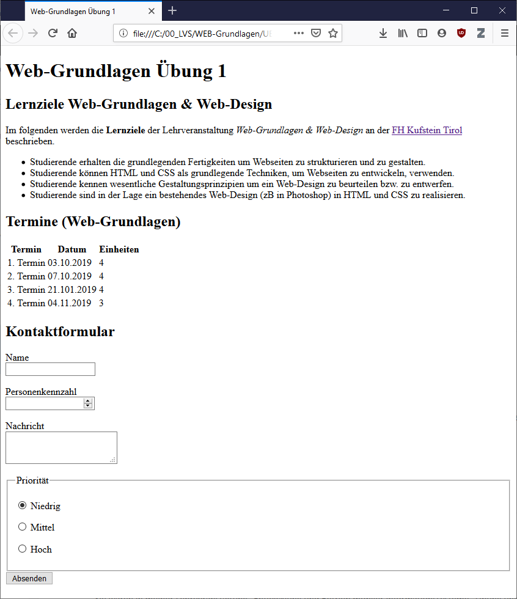

# Übung 1

!!! info "Abgabe"
    Die Abgabe erfolgt über Moodle im Slot `Übung 1`. Es soll ein ZIP-Archiv mit der Datei `ü1.html` abgegeben werden.

    **Es können nur Abgaben verarbeitet werden, welche diesem Layout entsprechen:**

        /
        /ü1.html

## HTML-Dokument erstellen
    
Die im Bild dargestellte Webseite soll mit HTML umgesetzt werden. Verwenden Sie die passenden HTML-Elemente zur Repräsentation der entsprechenden Inhalte. Sie finden den Rohtext [hier](ü1.txt) zum Download.

