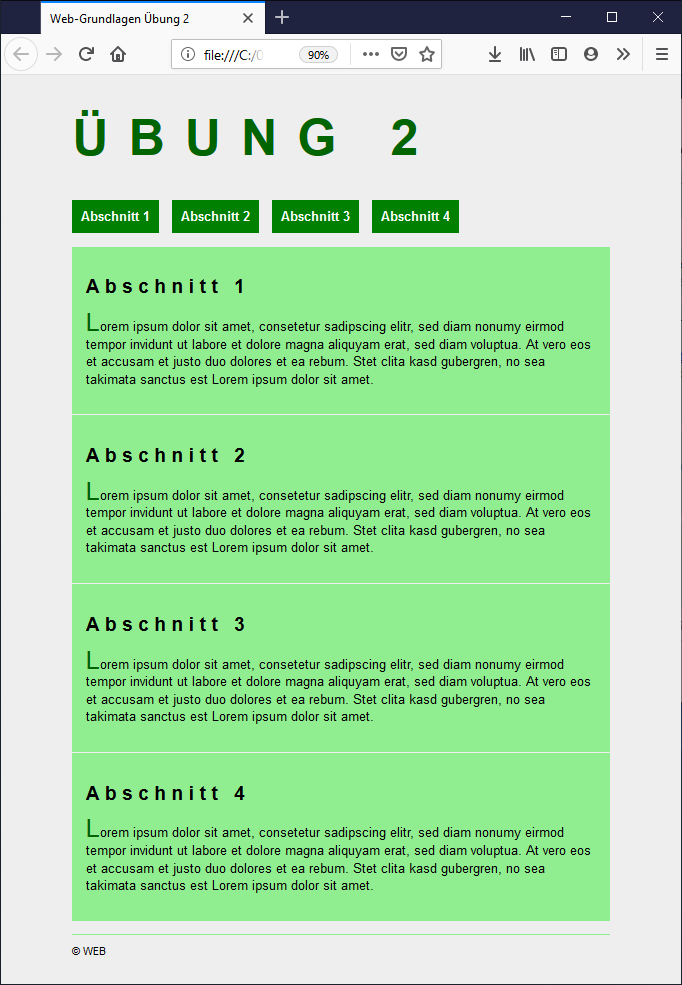

# Übung 2

!!! info "Abgabe"
    Die Abgabe erfolgt über Moodle im Slot `Übung 2`. Es soll ein ZIP-Archiv mit den Dateien `ü2.html` und `style.css` abgegeben werden.

    **Es können nur Abgaben verarbeitet werden, welche diesem Layout entsprechen:**

        /
        /ü2.html
        /style.css

## CSS-Stylesheet erstellen

Sie finden das HTML-Dokument `ü2.html` [hier](ü2.html) zum Download. Erstellen Sie eine style.css Datei im selben Ordner in dem sich das `ü2.html` Dokument befindet. Öffnen Sie das HTML-Dokument im Web-Browser Ihrer Wahl und passen Sie die style.css so an, dass es dem Screenshot entspricht. Einige Hinweise zum Screenshot:

 - Farben: `darkgreen`, `green`, `lightgreen`
 - Hintergrundfarbe: `#eee`
 - Maximale Breite des Hauptinhalts `600px`
 - Zur Zentrierung kann `margin-left` und `margin-right` mit dem Wert `auto` verwendet werden
 - Es ist auch auf `line-height` und `letter-spacing` zu achten

