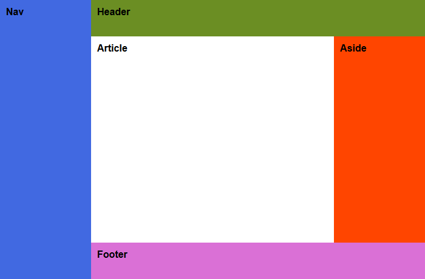

# Übung 3

!!! info "Abgabe"
    Die Abgabe erfolgt über Moodle im Slot `Übung 3`. Es soll ein ZIP-Archiv mit den Dateien `ü3_1.html` bis `ü3_4.html` abgegeben werden.

    **Es können nur Abgaben verarbeitet werden, welche diesem Layout entsprechen:**

        /
        /ü3_1.html
        /ü3_2.html
        /ü3_3.html
        /ü3_4.html

## CSS-Layouts erstellen

Sie finden das HTML-Dokument `ü3.html` [hier](ü3.html) zum Download. Erstellen Sie 4 Kopien der Datei im selben Ordner. Öffnen Sie die HTML-Dokument im Web-Browser Ihrer Wahl und passen Sie den jeweiligen internen Stylesheet so an, dass sie den Screenshots entsprechen. Verwenden Sie `CSS-Grids` für die Layouts.

### Layout 1

### Layout 2

### Layout 3

### Layout 4
