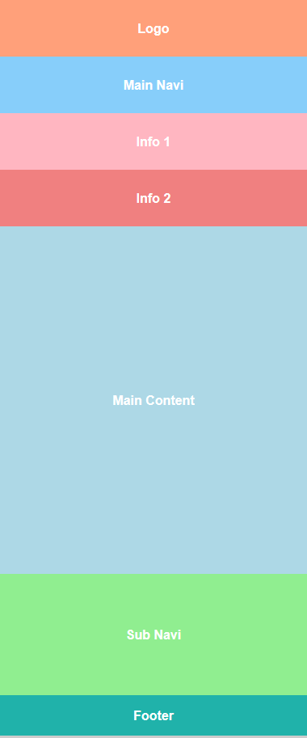
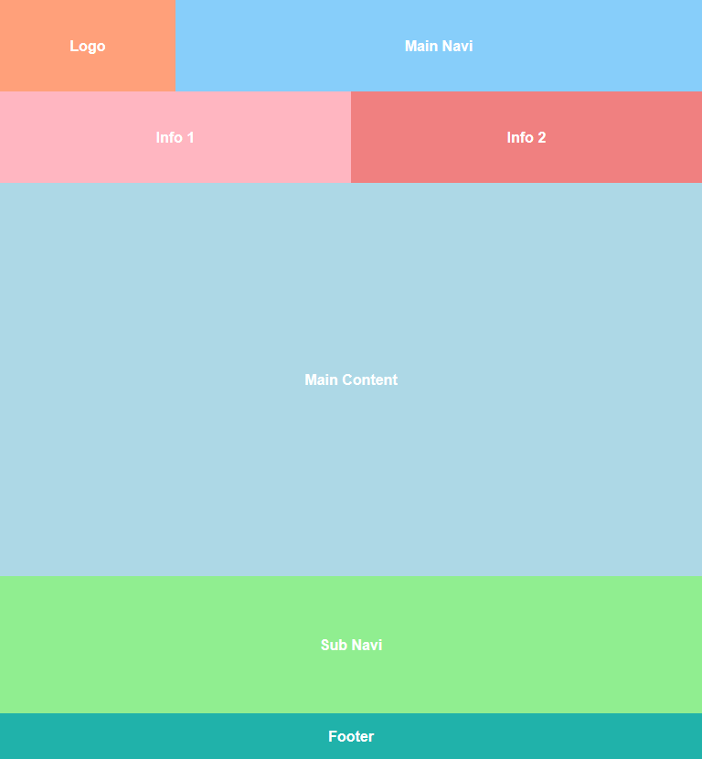
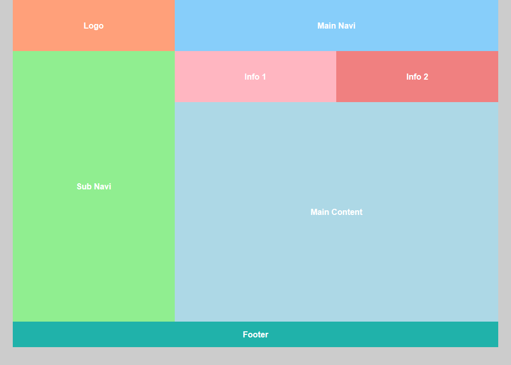
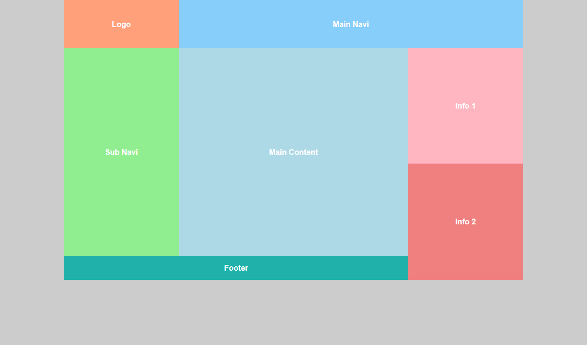

# Übung 5

!!! info "Abgabe"
    Die Abgabe erfolgt über Moodle im Slot `Übung 5`. Es soll ein ZIP-Archiv mit der Datei `ü5.html` und `style.css` abgegeben werden.

    **Es können nur Abgaben verarbeitet werden, welche diesem Layout entsprechen:**

        /
        /ü5.html
        /style.css

## Responsive Layout

Die 4 angegebenen Ansichten für Smartphone, Tablet, kleiner Desktop/Laptop und großer Desktop sollen jeweils umgesetzt werden. Es sollen dabei anhand von 3 Breakpoints in die unterschiedlichen Ansichten gewechselt werden. Folgende Breakpoints sollen beachtet werden:

- Breakpoint Tablet: 768px
- Breakpoint kleiner Desktop: 992px
- Breakpoint großer Desktop: 1200px

Die Farbwerte sind: `lightsalmon`, `lightskyblue`, `lightblue`, `lightgreen`, `lightpink`, `lightcoral`, `lightseagreen`.

### Layout Smartphone (`< 768px`)

### Layout Tablet (`>= 768px, < 992px`)

### Layout Small Desktop (`>= 992px, < 1200px`)

### Layout Desktop (`>= 1200px`)
