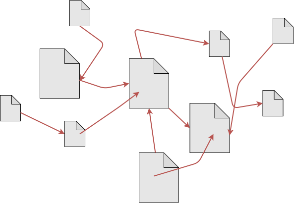
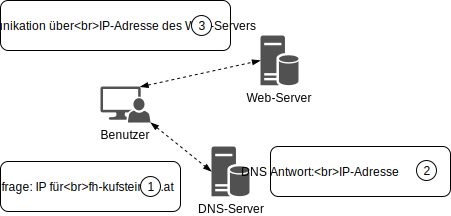
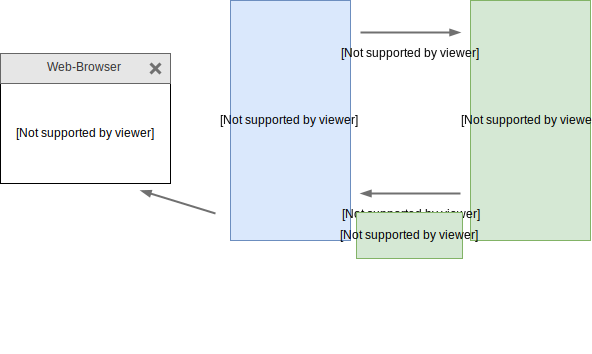
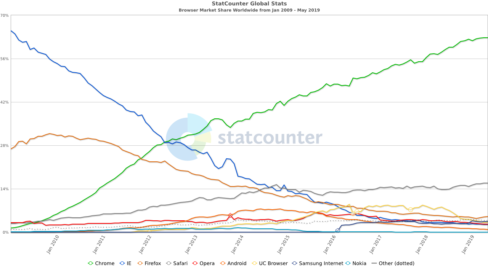
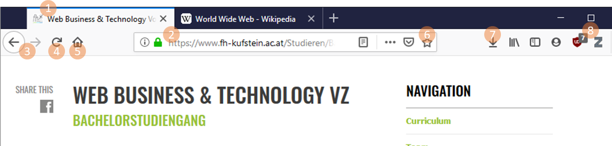

# World Wide Web (WWW)

 - Das WWW ist ein globales und verteiltes Informationssystem bestehend aus _Webseiten_ und anderen _Web-Ressourcen_ (zB Bilder, Videos, ...)
 - Web-Ressourcen werden auf Web-Servern bereitgestellt und sind öffentlich abrufbar
 - Web-Ressourcen sind über einen Uniform Resource Locator (URL) eindeutig identifiziert und abrufbar
 - Webseiten sind im WWW über _Hyperlinks_ miteinander verknüpft, welche wiederum als URL ausgedrückt werden
 -  Webseiten können über _Web-Browser_ (auch Web-Clients) geladen und bedient werden

.max.center[]

---

# URLs: Identifkation und Lokalisierung von Web-Ressourcen

 - Eine URL ist eine global eindeutige "Adresse" einer Web-Ressource
 - Zusätzlich zur Identifikation gibt eine URL Aufschluss über den Speicherort einer Web-Ressource (Lokalisierung)

Beispiel einer URL:
```html
        userinfo       host      port
        ┌──┴───┐ ┌──────┴──────┐ ┌┴┐
https://john.doe@www.example.com:123/abc/def/?name=bla&q=abc#top
└─┬─┘   └───────────┬──────────────┘└───┬───┘ └─────┬──────┘ └┬┘
scheme          authority              path       query    fragment
```

---

# Domain Name System (DNS)

 - Knoten im Internet sind über IP-Adressen identifiziert (zB 80.93.34.98)
 - IP-Adressen sind ähnlich wie Telefonnummern für Menschen schwer einprägsam
 - DNS verwaltet Klarnamen zu IP-Adressen 

Beispielhafter Auszug aus der Datenbank eines DNS-Servers:
```html
wikipedia.org         185.102.12.2
fh-kufstein.ac.at     85.234.32.2
...                   ...
```



---

# HTTP-Protokoll: Kommunikation zwischen Web-Browser und Web-Server

 - Das Hypertext Transfer Protocol (HTTP) ist ein zustandsloses Netzwerkprotokoll zur Übertragung von Daten in Rechnernetzen
 - Es wird hauptsächlich eingesetzt, um Webseiten aus dem WWW zu laden
 - Die Kommunikation folgt dem Anfrage/Antwort Schema
 - Der Client sendet eine Anfrage und bekommt eine Antwort vom Server

.max.center[]

---

# W3C: World Wide Web Conssortium

 - Das World Wide Web Consortium (W3C) ist die primäre internationale Standardisierungsorganisation des WWW
 - Gründer und Vorsitzender des W3C ist Tim Berners-Lee

 - Der W3C Standadisierungsprozess gliedert sich in Dokumente mit unterschiedlichem Reifegrad:
    - Working Draft (WD)
    - Candidate Recommendation (CR)
    - Proposed Recommendation (PR)
    - W3C Recommendation (REC)

> Beispiele für W3C Recommendations sind HTML, XML, CSS, PNG, SVG, DOM

---

# Clientseitige Web-Technologien

Zur Entwicklung von Webseiten bzw. Web-Anwendungen werden standardisierte Web-Technologien genutzt:

 - Hypertext Markup Language (HTML): HTML wird genutzt um Inhalte zu strukturieren
 - Cascading Stylesheets (CSS): CSS wird genutzt um Inhalte zu formatierung bzw. zu gestalten
 - JavaScript: Mit JavaScript wird Verhalten und Dynamik in eine Webseite integriert

---

# Web-Browser I

Ein Web-Browser ist eine Software-Applikation, welche genutzt wird um auf das WWW zuzugreifen. Die populärsten Web-Browser sind `Chrome`, `Firefox`, `Safari`, `Internet Explorer`, `Edge` und `Opera`

Die Marktanteile der Web-Browser sind unterschiedlich verteilt:

.max[]

---

# Web-Browser II

Alle Web-Browser bieten ähnliche Bedienelemente

.max[]

 1. Tabs
 2. Addressleiste
 3. Vor- und Zurück-Buttons
 4. Refresh-Button bzw. Stop-Button
 5. Home-Button
 6. Bookmarks/Lesezeichen
 7. Download-Historie
 8. Extensions

