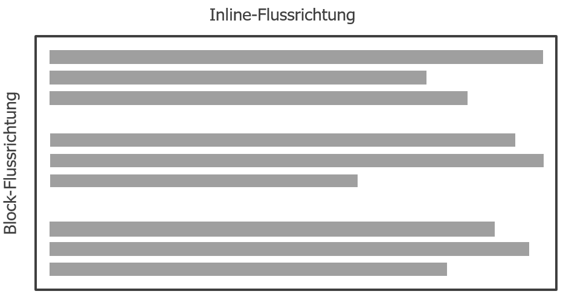

# HTML

Die Hypertext Markup Language (HTML) ist eine textbasierte Auszeichnungssprache zur Strukturierung von Webseiten (in diesem Zusammenhang als HTML-Dokumente bezeichnet). HTML basiert auf sog. Tags, welche als Text Bausteine mit den Zeichen `<` bzw. `>` definiert werden. HTML dient dabei nur der Strukturierung der Inhalte und legt keinerlei Formatierung fest.

## HTML-Markup Regeln

Ein HTML-Element hat mehrere Bestandteile:

 - Öffnendes Tag: Ein öffnendes Tag besteht aus den Klammersymbolen `<` und `>` und dem eingeschlossenen Tag-Name (zB `<p>`).
 - Schließendes Tag: Ähnlich zum öffnenden Tag besteht das schließende Tag aus den Klammersymbolen `<` und `>` und dem eingeschlossenen Tag-Namen. Zusätzlich wird durch Angabe des Slash-Symbols (`/`) das schließende Tag markiert (zB `</p>`).
 - Inhalt: Der tatsächliche Inhalt des HTML-Elements kann nur Text sein oder es können auch weitere HTML-Elemente als Kindelemente sein.
 - Attribute: HTML-Elemente können Attribute besitzen, welche zusätzliche Informationen zum HTML-Element liefern, welche nicht Teil des Inhalts sind. Attribute und zugehörige Attributwerte werden im öffnenden Tag angegeben. Das Attribut wird über `=` vom Attributwert getrennt und der Attributwert wird in `"` gesetzt.

Beispiel für ein HTML-Element:
```html
Öffnendes Tag       Schließendes Tag
      ┌┴┐                 ┌┴─┐
      <p>Ein HTML Beispiel</p>
         └───────┬───────┘
               Inhalt
      └──────────┬───────────┘
		     HTML-Element
```

Beispiel für ein HTML-Element mit Attribut:
```html
         Öffnendes Tag
      ┌─────────┴────────┐                 
      <p class="my-class">Ein HTML Beispiel</p>
         └─┬─┘ └───┬────┘
      Attribut   Attributwert      
```

Es gibt Ausnahmen, welche nicht den oben beschriebenen allgemeinen Regelungen folgen:

 - Leere HTML-Elemente: Es gibt HTML-Elemente, welche keinen expiziten textlichen Inhalt besitzen. Beispiele dafür sind: 
   - `<br>`: Zeilenumbruch
   - `<hr>`: Horizontale Trennline
   - ``: Bilder
- Boolsche Attribute: Es gibt Attribute, welche keinerlei Attributwert benötigen. Eine Angabe des Attributes würde einen Attributwert `true` implizieren. Ein Beispiel für ein boolsches Attribut ist `disabled`.

## Besondere syntaktische Konstrukte

### HTML Kommentare

In den meisten Programmier- bzw. Auszeichnungssprachen gibt es Kommentare, welche vom Web-Browser zur Generierung der Anzeige ignoriert werden.

Kommentare werden mit der Symbolfolge `<!--` gestartet und mit `-->` beendet.

```html
<!-- Ein Beispiel Kommentar -->
```

### HTML Entities

Es gibt unter anderem die Zeichen `<`, `>`, `"`, `&` welche Teil der HTML Syntax sind. Diese Zeichen müssen als spezielle `HTML-Entity` angegeben werden.

Eine HTML-Entity wird über ein `&` gestaret und mit einem `;` abgeschlossen. Dazwischen befindet sich ein Entitiy Bezeichner.

Beispiele für HTML-Entities:

| Zeichen | HTML-Entity  |
| --- | --- |
| `<` | `&lt;` |
| `>` | `&gt;` |
| `"` | `&quot;` |
| `&` | `&amp;` |

### Whitespace

Als Whitespace werden jegliche Leerräume, Tabulatoren und Zeilenumbrüche bezeichnet. Für die Darstellung von HTML hat Whitespace keine Bedeutung. Der Web-Browser ignoriert Whitespace generell und reduziert Whitespace zwischen 2 Wörtern auf genau einen Leerraum.

Die beiden Paragraphen im folgenden Beispiel resultieren in der selben Anzeige:
```html
<p>Beispiel für Whitespace</p>

<p>Beispiel        für
         Whitespace.</p>
```

## Aufbau eines HTML-Dokuments

HTML-Dokumente haben einen definierten Aufbau:

 - Ein HTML-Dokument startet mit einem `Doctype`, welcher die Version von HTML angibt (hier: HTML 5). Dem Web-Browser wird damit mitgeteilt, welche HTML-Version zu verarbeiten ist.
 - Ein HTML-Dokument hat `html` als Wurzelelement und 2 Kindelemente `head` und `body`
 - Im `head` befinden sich sog. Metadaten zum Dokument (zumindest der Titel, angegeben durch das `title` Element)
 - Im `body` befinden sich alle Inhalte, welche im Web-Browser dargestellt werden
 
```html
<!DOCTYPE html>
<html>
  <head>
    <meta charset="utf-8">
    <title>Meine Seite</title>
  </head>
  <body>
    <!-- HTML Elemente -->
  </body>
</html>
```

## Flow Layout

Das Default-Layout in HTML ist das sog. "Flow Layout", welches auch als "Normales Layout" bezeichnet wird. In HTML sind generell 2 Arten von Elementen definiert. Das sind einerseits `Inline-Elemente` und andererseits `Block-Elemente`:

 - `Block-Elemente`: HTML-Elemente werden von oben nach unten aufeinander gestapelt. `div` ist das generische Block-Element.
 - `Inline-Elemente`: HTML-Elemente werden entlang des Textflusses nebeneinander gesetzt. `span` ist das generische Inline-Element.



Die HTML-Elemente werden zur Darstellung vom Web-Browser in der Reihenfolge angezeigt wie sie im HTML-Dokument angegeben wurden. Zu beachten ist dabei die Textrichtung, welche unter anderem von der Sprache des HTML-Dokumentes festgelegt wird. 

> Die Textrichtung kann von Links nach Rechts (`ltr`) oder von Rechts nach Links (`rtl`) angegeben sein. Mit dem HTML-Attribut `dir` kann global auf dem `html-Tag` die Textrichtung geändert werden (Default ist `ltr`). Für Sprache wie zB Arabisch oder Hebräisch wird `rtl` genutzt.

Beispiele für Block-Elemente sind: `h1-h6`, `p`, `table`, `ul` und `div`. Beispiele für Inline-Elemente sind: `strong`, `em`, `img`, `a`, `input` und `span`.

## Wichtige HTML-Elemente

### Überschriften

Überschriften werden über die Tags `h1-h6` angegeben. Die Zahlen 1-6 spezifizieren dabei die Hierarchieebene.

Beispiel für Überschriften:
```html
<h1>Überschrift Ebene 1</h1>
<h2>Überschrift Ebene 2</h2>
<h3>Überschrift Ebene 3</h3>
<h4>Überschrift Ebene 4</h4>
<h5>Überschrift Ebene 5</h5>
<h6>Überschrift Ebene 6</h6>
```

### Textauszeichnung

Um Textstellen gesondert hervorzuheben können die Tags `strong` oder `em` verwendet werden.

Beispiel für Hervorhebungen:
```html
Das ist ein <strong>wichtiger</strong> Textabschnitt und dies ist ein <em>hervorgehobener</em> Textabschnitt.
```

### Paragraphen

Zusammenhängende Textabschnitte werden als Paragraphen über das `p-Tag` angegeben. 

Beispiel für 2 Paragraphen:
```html
<p>Ein erster Paragraph</p>
<p>Ein zweiter Paragraph</p>
```

### Geordnete oder ungeordnete Listen

Listen können über die Tags `ul` (ungeordnet) oder `ol` (geordnet) angegeben werden. Mit `li-Tags` werden Listeneinträge angegeben. Listeneinträge müssen dabei immer als Kindelemente von `li` oder `ol` angegeben werden.

Beispiel für eine ungeordnete Liste:
```html
<ul>
  <li>Eintrag 1</li>
  <li>Eintrag 2</li>
  <li>Eintrag 3</li>
</ul>
```

Beispiel für eine geordnete Liste:
```html
<ol>
  <li>Eintrag 1</li>
  <li>Eintrag 2</li>
  <li>Eintrag 3</li>
</ol>
```

### Hyperlinks

Hyperlinks spielen eine besondere Rolle in HTML da sie die Grundlage für den sog. Hypertext darstellen. Sie liefern die Möglichkeit unterschiedliche Webseiten miteinander zu verknüpfen. Hyperlinks werden über das `a-Tag` realisiert (a gilt dabei als Abkürzung für Anchor). Wichtige Attribute von Hyperlinks sind `href` und `target`:

 - Über `href` wird eine URL angegeben, welche das Ziel des Hyperlinks definiert.
 - Über `target` wird angegeben wie das Hyperlink im Web-Browser geöffnet werden soll. Zum Beispiel wird mit der Angabe `_blank` ein neues Browserfenster oder ein neuer Tab (je nach Interpretation des Web-Browsers) geöffnet.

Beispiel für ein Hyperlink:
```html
<a target="_blank" href="https://www.fh-kufstein.ac.at">Link</a>
```

### Bilder

Um Bilder in einer Webseite einzufügen wird das `img-Tag` genutzt. Das Tag stellt das Attribut `src` bereit um eine URL auf ein Bild anzugeben. Mit dem Attribut `alt` wird die Möglichkeit bereitgestellt eine textliche Beschreibung des Bildinhalts zu geben. Dies kann zum Beispiel für Suchmaschinenoptimierung oder aber auch aus Gründen der Accessibility genutzt werden.

Beispiel für ein Bild:
```html

```

### Tabellen
Zur Darstellung von tabellarischen Daten werden Tabellen benutzt. Tabellen sollen in keinem Fall dazu verwendet werden um Layouts zu erzeugen.

Über das `table-Tag` kann eine Tabelle definiert werden. Zeilen in einer Tabelle werden über das `tr-Tag` erzeugt. Innerhalb der Zeilen können Zellen definiert werden mit `td-Tags` (td für Tabledata). Für die Kopfzeile können Zellen mittels `th-Tags` (th für Tablehead) definiert werden.

```html
<table>
  <tr>
    <th>Band</th>
    <th>Album</th>
    <th>Veröffentlichungsjahr</th>
  </tr>
  <tr>
    <td>U2</td>
    <td>Boy</td>
    <td>1980</td>
  </tr>
  <tr>
    <td>Radiohead</td>
    <td>OK Computer</td>
    <td>1997</td>
  </tr>
  <tr>
    <td>The Mars Volta</td>
    <td>De-Loused in the Comatorium</td>
    <td>2003</td>
  </tr>  
</table>
```

In manchen Fällen ist es nötig Zellen in einer Tabelle über mehrere Spalten oder Zeilen zu verteilen. Mit den Attributen `colspan` bzw. `rowspan` kann für eine Zelle definiert werden über wieviele Spalten bzw. Zeilen diese verteilt werden soll.

### Formulare

Formulare werden genutzt um Benutzereingaben zu ermöglichen. Die eingegebenen Daten können direkt an einen Web-Server gesendet werden oder auch lokal verarbeitet werden.

Jedes Formular wird über ein `form-Tag` umgeben. Innerhalb eines Formular befinden sich Formularfelder. Gängige Formularfelder sind ein- oder mehrzeilige Textfelder, Auswahlfelder, Radio-Buttons oder Datumsfelder.

Einzelne Formularfelder können über das Tag `fieldset` gruppiert werden. Ein Fieldset kann über das `legend-Tag` eine entsprechende Beschriftung bekommen. Beschriftungen für einzelne Formularfelder können ebenfalls mit dem Tag `label` durchgeführt werden. Das `label-Tag` stellt das Attribut `for` bereit mit dem das Attribut `id` eines entsprechenden Formularfeldes referenziert wird.

Beispiel eines HTML-Formulars mit Text, Datums und Radio-Button Eingaben:
```html
<form>
  <p>
    <label for="input-name">Name</label>
    <input type="text" placeholder="Name" id="input-name" name="name">
  </p>
  <p>
    <label for="input-birthday">Geburtstag</label>
    <input type="date" placeholder="Geburtstag" id="input-birthday" name="birthday">
  </p>
  <fieldset>
    <legend>Priorität</legend>
    <p>
      <label for="input-priority-1">
        <input id="input-priority-1" type="radio" name="priority" value="1"> Hoch
      </label>
    </p>
    <p>
      <label for="input-priority-2">
        <input id="input-priority-2" type="radio" name="priority" value="2"> Mittel
      </label>
    </p>
    <p>
      <label for="input-priority-3">
        <input id="input-priority-3" type="radio" name="priority" value="3"> Niedrig
      </label>
    </p>
  </fieldset>
  <label>
</form>
```

## Strukturierung eines HTML-Dokuments

Im Beispiel wird ein typischer Aufbau einer Webseite skizziert. HTML stellt Elemente bereit, welche eine spezifische Bedeutung für den Inhalt implizieren. Diese Elemente sollen zur Strukturierung verwendet werden, sodass das HTML-Markup Bedeutung erhält. Für Web-Crawler oder Assistenztechnologien (zB Braille-Browser, Screenreader) kann die Webseite somit besser interpretiert werden.


Folgend sollen die wichtigsten Struktur-Elemente kurz beschrieben werden:

 - `<main>`: Dieses Tag sollte nur einmal pro Webseite verwendet werden und soll als Wrapper für den Hauptinhalt der Webseite fungieren.
 - `<article>`: Schließt einen zusammenhängenden Inhalt ein, welcher für sich stehen kann.
 - `<section>`: Gruppierungselement um einen zusammenhängenden Teil einer Webseite zusammenzufassen.
 - `<aside>`: Nicht direkt mit dem `<main>` Inhalt verknüpfte Inhalte. Zum Beispiel für wiederkehrende Inhalte auf mehreren Webseiten.
 - `<nav>`: Enthält die Hauptnavigation der Website.
 - `<header>`: Stellt einleitenden Inhalt dar. 
 - `<footer>`: Stellt abschließenden Inhalt dar.

## Validität von HTML

Um eine korrekte Interpretation des HTML-Dokumentes zu gewährleisten, muss sichergestellt werden, dass keinerlei syntaktische Fehler im HTML-Markup vorherrschen. HTML-Validatoren können genutzt werden um ein HTML-Dokument automatisiert auf syntaktische Fehler zu prüfen.

Das W3C stellt einen standardkonformen HTML-Validator zur Verfügung ([https://validator.w3.org](https://validator.w3.org)). Dieser Validator unterscheidet zwischen Fehlern (Error) und Warnungen (Warning):

 - Fehler sollten immer behoben werden, da dies ein konkretes syntaktisches Problem bezeichnet.
 - Warnung können behoben werden, diese sind vorranging für Barrierefreiheit und Suchmaschinen vorteilhaft.