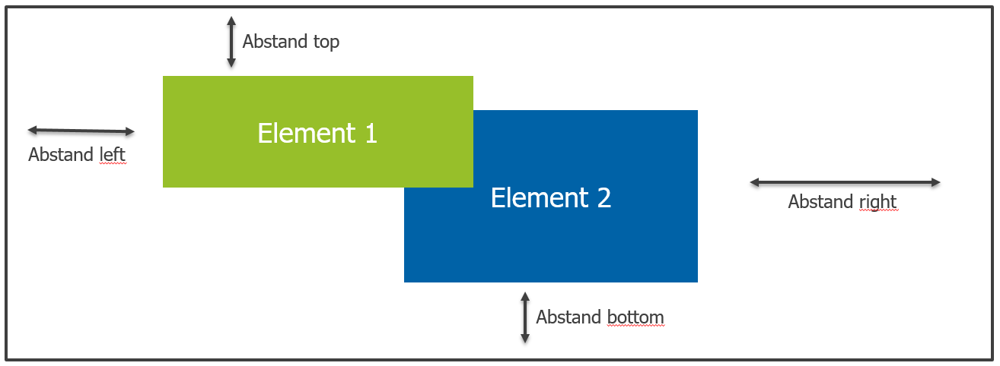
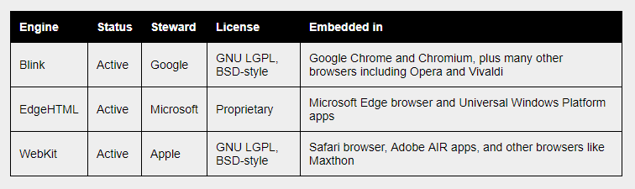
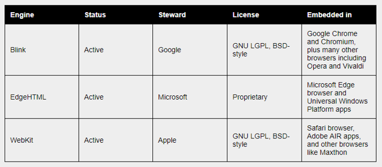

# Layouts und Positionierung

Das Default-Layout in HTML ist das sog. "Flow-Layout". Dabei werden HTML-Elemente anhand ihrer `display-Eigenschaft` als `block` oder `inline` ausgerichtet. Moderne Webseiten haben komplexe Layouts, welche über das Flow Layout alleine nicht realisierbar wären. Eine Option die CSS bereitstellt ist die Positionierung von HTML-Elementen. Weitere Optionen sind die Layout-Systeme `flexbox` und `grid`. 

## Positionierung

Mit den CSS-Eigenschaften `left`, `top`, `right` und `bottom` können HTML-Elemente individuell positioniert werden. Zur Festlegung des Koordinaten-Ursprungs (0,0) können verschieden Angaben zur CSS-Eigenschaft `position` getätigt werden.



Die folgenden Positionsangaben sind definiert:

 - `static`: Dies ist default und positioniert das HTML-Element entlag des normalen Flusses (Flow-Layout). Die CSS-Eigenschaften `left`, `top`, `right`, `bottom` und `z-index` haben keine Auswirkung.
 - `relative`: Das HTML-Element wird aus dem normalen Fluss entfernt und kann einen _relativen Abstand_ zur eigentlichen (durch das Flow-Layout festgeleten) Position festlegen. Die Position kann dabei über die CSS-Eigenschaften `left`, `top`, etc festgelegt werden. Die eigentliche Position des HTML-Elements bleibt dabei _leer_. Die relative Positionierung hat _keinen Einfluss_ auf andere HTML-Elemente.
 - `absolute`: Das HTML-Element wird aus dem normalen Fluss entfert und kann einen _absoluten Abstand_ zum Ursprung festlegen. Der Ursprung wird dabei durch die linke obere Ecke des Elternelements in der Hierarchie nach oben festgelegt, dass keine `static` Positionierung hat. Als letzte Instanz würde der Wurzelknoten `html` fungieren.
 - `fixed`: Ähnlich zur `absolute-Positionierung` jedoch bleibt das HTML-Element auch bei Scrolling an der festgelegten Position stehen.

### Beispiel zur relativen Positionierung

Durch die relative Positionierung wird die festgelegte Position durch das Flow-Layout als Koordinaten-Ursprung festgelegt. Die Positionsangaben `left`, `right`, `top` und `bottom` bezeihen sich dabei relativ zu Koordinaten-Ursprung.

Der Ausgangspunkt für das Beispiel sind 4 quadratische HTML-Elemente, welche im normalen Fluss positioniert sind:
<section style="border:1px dashed #ccc;">
  <div style="margin:10px;width:80px;height:80px;display:inline-block;background:blue;"></div>
  <div style="margin:10px;width:80px;height:80px;display:inline-block;background:blue;"></div>
  <div style="margin:10px;width:80px;height:80px;display:inline-block;background:blue;"></div>
  <div style="margin:10px;width:80px;height:80px;display:inline-block;background:blue;"></div>
</section>


Im Beispiel wird das zugehörige HTML gezeigt:
```html
<section>
  <div class="element"></div>
  <div class="element position-element"></div>
  <div class="element"></div>
  <div class="element"></div>
</section>
```

Im Beispiel wird das zugehörige CSS gezeigt:
```css
.element {
  margin:10px;
  width:80px;
  height:80px;
  display:inline-block;
  background:blue;
}
```

Durch eine relative Positionsangabe soll das zweite Quadrat (rot) `50px` von links und `20px` von unten verschoben werden:
<section style="border:1px dashed #ccc;">
  <div style="margin:10px;width:80px;height:80px;display:inline-block;background:blue;"></div>
  <div style="margin:10px;width:80px;height:80px;display:inline-block;background:red;position:relative;left:50px;bottom:20px;"></div>
  <div style="margin:10px;width:80px;height:80px;display:inline-block;background:blue;"></div>
  <div style="margin:10px;width:80px;height:80px;display:inline-block;background:blue;"></div>
</section>


Die entsprechende CSS Änderung sieht dazu folgendermaßen aus:
```css
.position-element {
  position:relative;
  background:red;
  left:50px;
  bottom:20px;
}
```

Im Beispiel wird ersichtlich, dass der vom Flow-Layout vorgegebene Platz für das zweite Quadrat frei bleibt.

### Beispiel zur absoluten Positionierung

Durch die absolute Positionierung wird die festgelegte Position des Flow-Layout freigegeben. Die Positionsangaben `left`, `right`, `top` und `bottom` bezeihen sich dabei auf die nach oben nächsten `relative` oder `fixed` positioniertem HTML-Element in der Hierarchie. 

Der Ausgangspunkt für das Beispiel sind 4 quadratische HTML-Elemente, welche im normalen Fluss positioniert sind:
<section style="border:1px dashed #ccc;">
  <div style="margin:10px;width:80px;height:80px;display:inline-block;background:blue;"></div>
  <div style="margin:10px;width:80px;height:80px;display:inline-block;background:blue;"></div>
  <div style="margin:10px;width:80px;height:80px;display:inline-block;background:blue;"></div>
  <div style="margin:10px;width:80px;height:80px;display:inline-block;background:blue;"></div>
</section>


Im Beispiel wird das zugehörige HTML gezeigt:
```html
<section>
  <div class="element"></div>
  <div class="element position-element"></div>
  <div class="element"></div>
  <div class="element"></div>
</section>
```

Im Beispiel wird das zugehörige CSS gezeigt. Die `section` wird mit einer relativen Position gesetzt, sodass sie als Koordinaten-Ursprung für das absolut Positionierte HTML-Element dient:
```css
section {
  position:relative;
}
.element {
  margin:10px;
  width:80px;
  height:80px;
  display:inline-block;
  background:blue;
}
```

Durch eine absolute Positionsangabe soll das zweite Quadrat (rot) `-25px` von rechts und `-25px` von oben verschoben werden. Die Referenz für die Positionsangaben ist dabei das umgebende `section-Element`:
<section style="margin:30px 0; border:1px dashed #ccc;position:relative;">
  <div style="margin:10px;width:80px;height:80px;display:inline-block;background:blue;"></div>
  <div style="margin:10px;width:80px;height:80px;display:inline-block;background:red;position:absolute;top:-25px;right:-25px;"></div>
  <div style="margin:10px;width:80px;height:80px;display:inline-block;background:blue;"></div>
  <div style="margin:10px;width:80px;height:80px;display:inline-block;background:blue;"></div>
</section>


Die entsprechende CSS Änderung sieht dazu folgendermaßen aus:
```css
.position-element {
  position:absolute;
  background:red;
  right:-25px;
  top:-25px;
}
```

Im Beispiel wird ersichtlich, dass der vom Flow-Layout vorgegebene Platz für das zweite Quadrat freigegeben und aufgefüllt wird.

### Beispiel für z-index Änderungen

HTML-Elemente des normalen Flussen haben den `z-index` mit `0` gesetzt. Beim relativ Positionierten HTML-Element kann der `z-index` verändert werden.

## Grid-Layout

Das CSS-Grid Layout ist das mächtigste Layout-System für CSS. Mit dem CSS-Grid können 2-dimensionale Layouts über Spalten und Zeilen definiert werden. Wesentliche Bausteine sind der Grid-Container (Elternelement) und die Grid-Items (Kindelemente, Zellen).

Für eine umfassende Beschreibung des CSS Grid-Layouts wird auf [A Complete Guide to Grid](https://css-tricks.com/snippets/css/complete-guide-grid/) verwiesen.

## Flexbox-Layout

Das CSS Flexbox Layout-System ist ein sehr flexibles und primär 1-dimensionales Layout. Ähnlich zum Grid-Layout wird es über den Flexbox-Container (Elternelement) und die Flex-Items (Kindelemente) definiert.

Für eine umfassende Beschreibung des CSS Flexbox-Layouts wird auf [A Complete Guide to Flexbox](https://css-tricks.com/snippets/css/a-guide-to-flexbox/) verwiesen.

## Tabellen

Tabellen werden ausschließlich zur Darstellung von tabellarischen Daten genutzt. Zur Darstellung der Tabelleninhalte gibt es 2 Layoutvarianten (CSS-Eigenschaft `table-layout`), welche die Tabellenbreite bzw. die Spaltenbreite berechnen:

 - `auto`: Die Tabellenbreite bzw. auch die Spaltenbreite passt sich am Inhalt an und ist je Spalte unterschiedlich. Dies ist die Default-Einstellung. Das Result ist dabei "unvorhersehbar".
 - `fixed`: Die Spaltenbreite wird über eine einfache Formel berechnet `Spaltenbreite = Tabellenbreit / Anzahl Spalten`. Wichtig dabei ist für die Tabelle die Breite `width:100%;` anzugeben, sodass der ganze verfügbare Platz ausgenutzt ist.

Beispiel für das Tabellenlayout `auto`:


Beispiel für das Tabellenlayout `fixed`:



