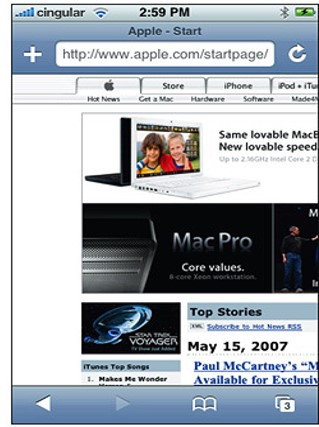
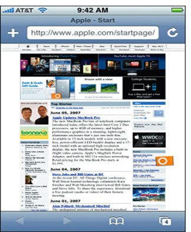
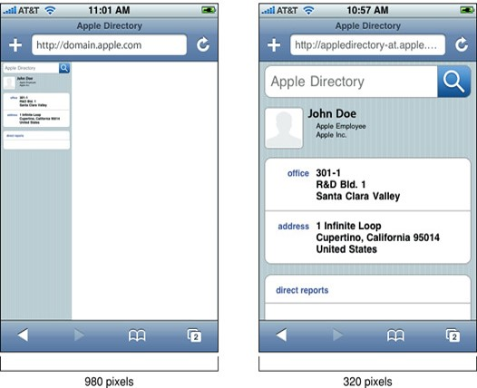

# Responsive Web

Das WWW kann grundsätzlich über unterschiedliche Geräte betrachtet und bedient werden. Nahezu für jedes Gerät gibt es einen Web-Browser. Responsive Web Design (RWD) ist ein Ansatz um Webseiten so zu gestalten, dass sich ihr Layout bzw. die allgemeine Gestaltung und Bedienung auf die verfügbaren Möglichkeiten (zB Bildschirmgröße) des entsprechenden Gerätes anpasst.

## Viewport

Mit den ersten Smartphones (unter anderem iPhone 1) wurde ersichtlich, dass die Erstellung von Webseiten mit fixen Breiten ein Problem darstellt. Am Smartphone konnte nur ein kleiner Ausschnitt einer Webseite angezeigt werden.

Als Lösung wurde ein sog. Viewport definiert. Ein Viewport stellt eine "virtuelle" Zeichenfläche dar, welche eine dedizierte Breite und Höhe aufweist (von Web-Browsern unterschiedliche festgelegt zB mit Breite 980px). Die Webseite wird auf die virtuelle Zeichenfläche geladen und diese Zeichenfläche wird dann angepasst und auf das tatsächliche Display projiziert.

Im folgenden Bild wird gezeigt wie sich das Problem der "fixen Breite" einer Webseite darstellt:



Im folgenden Bild wird gezeigt wie das Problem der "fixen Breite" einer Webseite durch die Einführung des Viewport gelöst wurde:



Die beschriebene Viewport-Projektion ist bei Smartphone und Tablet Browsern aktiviert. Bei speziell angepassten mobilen Webseiten fürht dies jedoch zum Problem, dass die Default-Viewport-Größe zu groß ist und der rechte Bereit weiß bleibt. Deshalb kann mit dem speziellen `viewport-Metatag` eine Anpassung der Viewport-Größe durchgeführt werden.

```html
<meta name="viewport" content="width=device-width, initial-scale=1"> 
```

Für das `viewport-Metatag` können unter anderem folgende Parameter spezifiziert werden: `width`, `initial-scale`, `minimum-scale` oder `maximum-scale`.

Im folgenden Bild wird gezeigt wie sich die Anpassung der Viewport Größe auf die Darstellung am Smartphone auswirkt:



Beispiele von Pixel bzw. Viewport Größen populärer Geräte:

| Bezeichnung | Pixel | Viewport |
| --- | --- | --- |
| iPhone XR | 828x1792 | 414x896 |
| iPhone 8 | 750x1334 | 375x667 |
| iPhone 7 | 750x1334 | 375x667 |
| iPad Air 1 & 2 | 1536x2048| 768x1024 |
| Google Pixel 3 | 1080x2160 | 412x824 | 
| Samsung Galaxy S9 | 1440x2960 | 360x740 |
| Nexus 9 | 1536x2048 | 768x1024 |

## Mediatypes

Mit Mediatypes werden unterschiedliche Ausgabegeräte definiert. Durch Angabe eines Mediatypes bei der Definition eines Stylesheets können diese medienspezifisch geladen werden.

Die Mediatypes `all`, `print`, `screen` und `speech` sind definiert. Der Mediatype `all` ist dabei als Defaultwert zu verstehen. Im folgenden Beispiel wird gezeigt wie ein Stylesheet eingebunden werden kann, welcher nur für Mediatype `print` geladen werden soll:
```html
<link rel="stylesheet" type="text/css" href="beispiel.css" media="print">
```

## Mediaqueries

Innerhalb von CSS-Stylescheets können Mediaqueries eingefügt werden. Mit Mediaqueries können Bedingungen definiert weden um CSS-Regeln konditional zu laden.

Folgend sind die wesentlichen Bestandteile eine Mediaquery:

 - Eine Mediaquery wird syntaktisch mit dem `@media` Schlüsselwort eingeleitet.
 - Als Bedingung können Mediatypes genutzt werden.
 - Als Bedingung können Mediafeatures genutzt werden.
 - Mediatype bzw. Mediafeatures können über logische Verknüpfungen kombiniert werden.

Beispiel einer Mediaquery:
```css
@media screen and (min-width: 420px) {
  .example-class {
    font-size: 16px;
    /* ... */
  }
}
```

### Mediaquery: Media Features

| Feature | Beschreibung |
| --- | --- |
| `width`, `min-width`, `max-width` | Breite des Viewports |
| `height`, `min-height`, `max-height` | Höhe des Viewport |
| `aspect-ratio` | Verhältnis von Höhe zu Breite des Viewport |
| `orientation` | Portrait oder Landscape Orientierung des Viewport |
| `hover` | Unterstützt das Eingabegerät den hover-Effekt (zB Desktop: ja / Smartphone u. Tablet: nein) |

Neben den Features, welche in der Tabelle beschrieben wurden und gängig sind, gibt es noch viele weitere sehr spezielle Features. Beispiele für weitere Features: `resolution`, `scan`, `grid`, `update`, `color`, `monochrome`

### Mediaquery: Logische Verknüpfungen

| Verknüpfung | Beschreibung |
| --- | --- |
| `and` | Und-Verknüpfung: Es müssen alle Bedingungen der Mediaquery WAHR sein damit die CSS-Regeln geladen werden. |
| `,` | Oder-Verknüpfung: Es muss zumindest eine Bedingung der Mediaquery WAHR sein damit die CSS-Regeln geladen werden. | 
| `not` | Negation: Alles außer die angegebene Bindung muss WAHR sein damit die CSS-Regeln geladen werden. |
| `only` | Auf alten Browsern (welche Mediaqueries nicht umfänglich unterstützen) kann mit `only` veranlasst werden, dass dieser die Mediaquery ignoriert (zB IE6 – IE8) |

### Mediaquery Beispiele

Die folgende Mediaquery wird für den Mediatype Bildschirm und eine Viewport Größe zwischen 768px und 991px aktiviert:
```css
@media screen and (min-width:768px) and (max-width:991px) {
  /* */
}
```

Die folgende Mediaquery wird für den Mediatype Bildschirm und Druck aktiviert:
```css
@media screen, print {
	/* */
}
```

Die folgende Mediaquery wird für Geräte aktiviert, welche den Hover-Effekt unterstützen (Vorraussetzung einer Maus-basierten Navigation)
```css
@media (hover: hover) {
	/* */
}
```