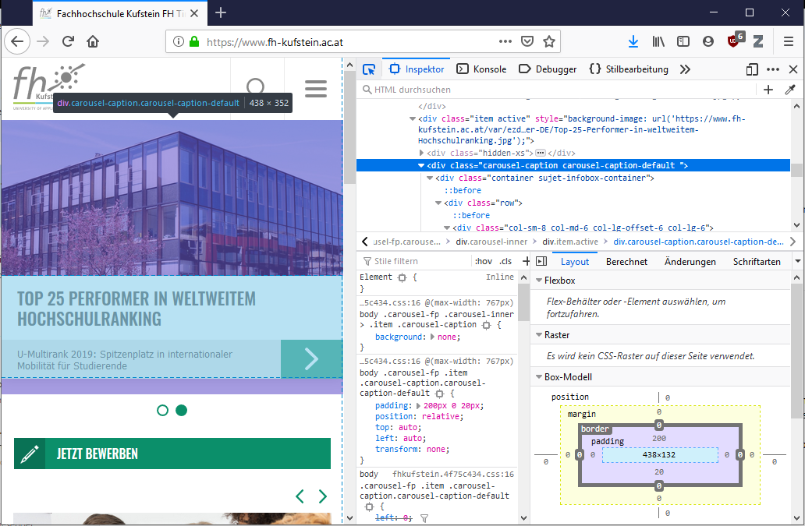

# Praktische Aspekte und Links

## Web-Browser Kompatibilität

Leider implementieren nicht alle Web-Browser die definierten W3C-Standards korrekt. Neue Standards werden erst mit etwas Zeitverzögerung in allen Web-Browern implementiert. Eine gute Übersicht über die Kompatibilität von unterschiedlichen Funktionen in unterschiedlischen Web-Browsern findet sich auf der Webseite [Can I use](https://caniuse.com/).

## Web-Browser Entwicklerwerkzeuge

Moderne Web-Browser stellen Entwicklerwerkzeuge bereit. Über den Shortcut `Ctrl+Shift+i` können die Entwicklerwerkzeuge geöffnet werden.

## Lernspiele

 - [Grid Garden](http://cssgridgarden.com/)
 - [Flexbox Froggy](https://flexboxfroggy.com/)
 - [CSS Diner](https://flukeout.github.io/)
 - [codepip](https://codepip.com)

## Links

 - [MDN Web Docs (Mozilla)](https://developer.mozilla.org/en-US/docs/Web)
 - [web.dev (Google)](https://web.dev/)
 - [A Complete Guide to Flexbox](https://css-tricks.com/snippets/css/a-guide-to-flexbox/)
 - [A Complete Guide to Grid](https://css-tricks.com/snippets/css/complete-guide-grid/)
 - [A free guide to HTML5 <head> elements](https://htmlhead.dev/)
